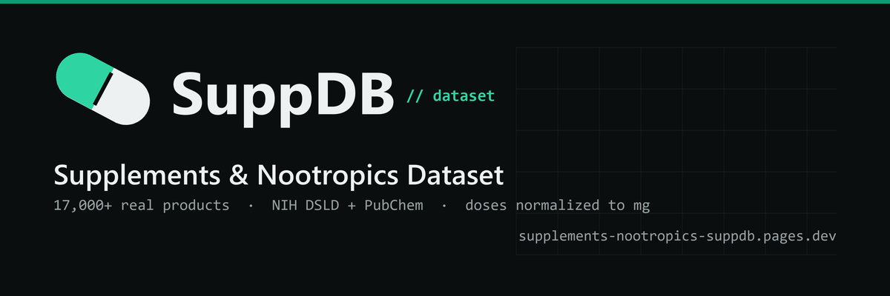

<div align="center">



# 💊 SuppDB — Supplements & Nootropics Dataset

**17,000+ real supplement products · 2,000+ brands · normalized mg dosages · proprietary-blend flags · NIH PubChem chemistry**

[](samples/suppdb_sample.csv)
[](https://huggingface.co/datasets/Ichlibitiche/suppdb-supplements-sample)
[](https://huggingface.co/spaces/Ichlibitiche/dataset-sample-explorers)
[](#whats-inside)
[](#provenance)
[](CHANGELOG.md)
[](https://supplements-nootropics-suppdb.pages.dev)

**[→ Get the full dataset at suppdb.net](https://supplements-nootropics-suppdb.pages.dev)**

</div>

---

A structured dataset of real supplement & nootropic products, built **exclusively from the public [NIH Dietary Supplement Label Database (DSLD)](https://dsld.od.nih.gov/)** — every active ingredient normalized to **milligrams**, proprietary blends flagged where the dose is undisclosed, and each compound enriched with **NIH PubChem** chemical identity. A **source label ID + URL on every record** means any fact can be re-verified against the original label.

This is a **label-facts + chemistry** dataset — think *INCIDecoder for supplements*: one row per active ingredient, with its dose, form, safety reference, and molecular identity. It is built only from **public-domain U.S. Government data**, so it is clean to use commercially. The honest [field-coverage table](#field-coverage-the-honest-numbers) below shows exactly what is and isn't populated. No hype — just what's in the box.

## What's inside

| | Full dataset | Free sample |
| :--- | ---: | ---: |
| Supplement products | **17,000+** | 300 |
| Brands | **2,000+** | 218 |
| Active-ingredient records | **115,000+** | 2,249 |
| Proprietary-blend flags | **40,000+** | 883 |
| Compounds w/ PubChem chemistry | **4,000+** | 50% of rows |
| Formats | SQLite · CSV · JSON | CSV |

The free [`samples/suppdb_sample.csv`](samples/suppdb_sample.csv) is a flat, one-row-per-ingredient table — **2,249 ingredient records across 300 real products from 218 brands** — a true taste of the schema and quality. Explore it interactively in the [🤗 Sample Explorer](https://huggingface.co/spaces/Ichlibitiche/dataset-sample-explorers), or load it straight from the [🤗 sample dataset](https://huggingface.co/datasets/Ichlibitiche/suppdb-supplements-sample). The full dataset is available at **[suppdb.net](https://supplements-nootropics-suppdb.pages.dev)**.

## Field coverage (the honest numbers)

Measured across all 17,000+ products. Published up front so you can decide if the fields you need are covered — supplement labels don't all publish every attribute, and reference/chemistry data only exists for some compounds.

| Field | Coverage | | Field | Coverage |
| :--- | ---: | --- | :--- | ---: |
| Brand / product / ingredient | 100% | | Proprietary-blend flag | 37% of rows |
| UPC barcode | 86% | | RDA / upper-limit (NIH DRI) | ~9% of compounds |
| Dose normalized to mg | 100%\* | | PubChem CID / formula / weight | ~25% of compounds |
| Serving size | 100% | | SMILES / InChIKey | ~25% of compounds |
| Servings per container | 85% | | Retail price | 0%† |

\* `amount_per_serving_mg` is `0` where the ingredient sits inside a **proprietary blend** (dose undisclosed on the label) — flagged by `is_proprietary_blend = 1`.
† DSLD labels do not carry a retail price, so `retail_price_usd` is intentionally absent — we don't fabricate it.

## What makes it useful — the differentiated parts

- **Normalized mg dosages.** Every active ingredient converted to standardized milligrams — `mcg`, `g`, and substance-specific `IU` handled correctly (e.g. Vitamin D 1,000 IU → 0.025 mg, not a bogus flat factor).
- **Proprietary-blend transparency.** Ingredients whose per-serving dose is hidden on the label are flagged `is_proprietary_blend = 1` with `amount = 0` — you can *see the hidden-dose ingredients*, not just miss them.
- **PubChem chemistry + canonicalization.** `pubchem_cid`, `molecular_formula`, `molecular_weight`, `canonical_smiles`, `inchikey`. The **InChIKey** is a canonical chemical key — rows sharing one are the same molecule under different label names (e.g. *Vitamin C* and *Ascorbic Acid* → same InChIKey), so you can canonicalize deterministically.
- **NIH DRI reference intakes.** `recommended_daily_mg` / `upper_safety_limit_mg` populated from authoritative NIH Dietary Reference Intakes, and **NULL** where no official value exists — never invented.

## Provenance

Every record is traceable and re-verifiable:

| Field | Meaning |
| :--- | :--- |
| `brand` | Brand / manufacturer as printed on the label |
| `source_url` | Exact NIH DSLD label page the data came from |
| `dsld_label_id` | DSLD label identifier |
| `dataset_version` | Snapshot id (`2026.07`) |

Underlying data: **NIH DSLD** (labels) + **NIH PubChem** (chemistry) — both U.S. Government **public domain**. See [`DATA_DICTIONARY.md`](DATA_DICTIONARY.md) for every field.

## Pricing

| Tier | What | Price |
| :--- | :--- | :--- |
| **Sample** | ~300 products, flat CSV (this repo) | Free |
| **Snapshot** | Full 17,000+ products · SQLite + CSV + JSON | **$49** one-time |
| **Custom & Enterprise** | Your target brands/ingredients · recurring refreshes · API | **$99+** |

**[→ Get it at suppdb.net](https://supplements-nootropics-suppdb.pages.dev)** · or email **[suppdb.doorframe589@simplelogin.com](mailto:suppdb.doorframe589@simplelogin.com)** for custom work.

## Use cases

- AI health co-pilots & supplement recommendation apps (structured dose + chemistry data)
- Ingredient/dose comparison and proprietary-blend transparency tools
- ML / RAG corpora over supplement labels
- Formulation, market, and assortment research across brands and ingredient categories

## Quick look

```python
import csv
rows = list(csv.DictReader(open("samples/suppdb_sample.csv", encoding="utf-8")))
print(len(rows), "ingredient records from", len({r["product_id"] for r in rows}), "products")
```

A fuller example is in [`examples/load_sample.py`](examples/load_sample.py).

## License

- **Sample data & docs in this repo:** CC-BY-NC-4.0 — free to use with attribution, non-commercial (see [`LICENSE`](LICENSE)).
- **Full dataset:** commercial license, available at [suppdb.net](https://supplements-nootropics-suppdb.pages.dev). The underlying facts are public-domain (NIH DSLD + PubChem); the license covers SuppDB's curated, normalized compilation.

**Not medical advice.** SuppDB is factual reference data compiled from public labels — always verify against the current physical label. Are you a brand and want a record corrected? Email **[suppdb.doorframe589@simplelogin.com](mailto:suppdb.doorframe589@simplelogin.com)**.
